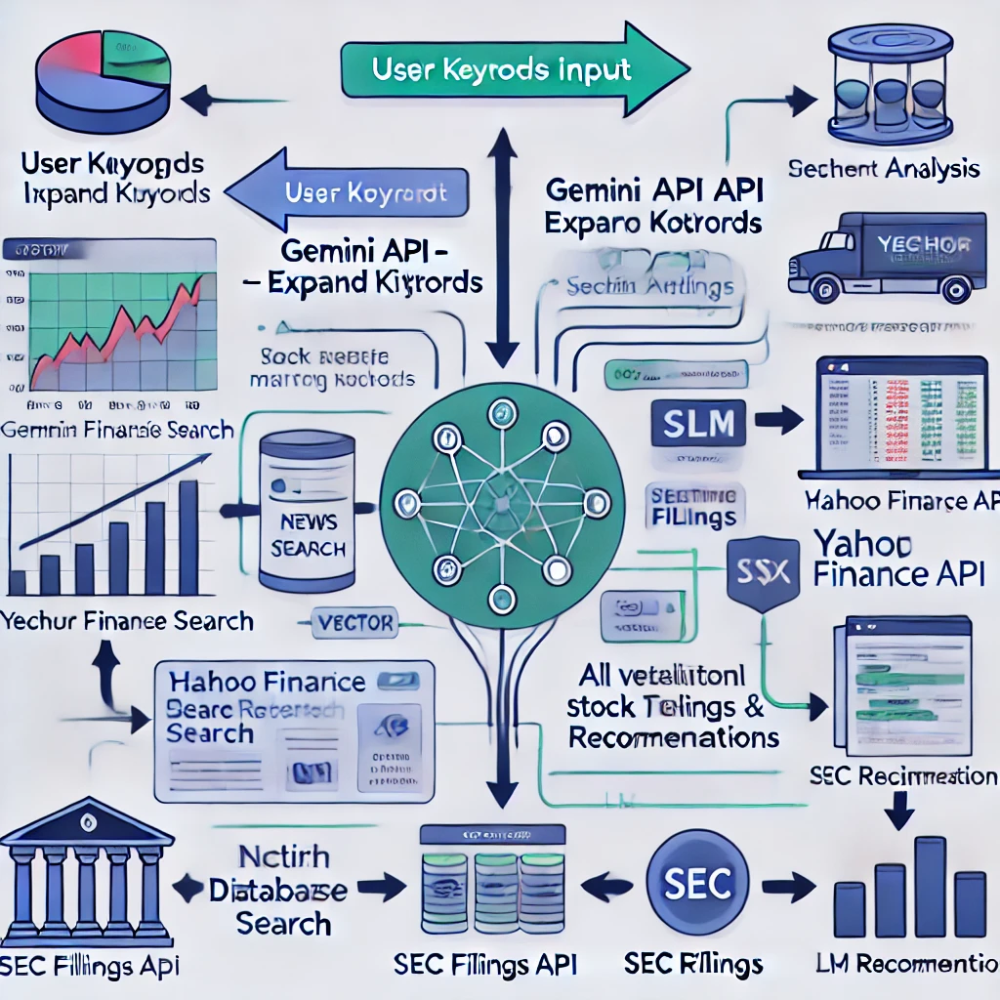

# CipherStockX

**CipherStockX** is an innovative stock analysis platform designed to decode market trends and insights. Leveraging advanced AI and machine learning models, it empowers users with real-time data, sentiment analysis, and performance scoring to enhance trading decisions. The interactive and sleek web interface, powered by Streamlit, provides a comprehensive view of market metrics, stock performance, and SEC filing analyses.

## Demo

## Hosted Website
Our project is hosted on: [CipherStockX](https://cipherstockx.streamlit.app/) 

If you're experiencing issues, consider trying a more stable version to get a better feel for the app here:  [CipherStockX Stabel](https://cipherstockx-stabel.streamlit.app/)

## Workflow

## Architecture
- **User Keywords Input**: Users provide initial keywords related to stocks or sectors of interest.
- **Gemini API - Expand Keywords**: Gemini API generates additional, relevant keywords, widening the stock search.
- **Vector Database Search**: Uses expanded keywords to find closely matching stocks in the vector database.
- **Yahoo Finance API Data Retrieval**: Gathers stock data, news articles, and performance metrics.
- **Sentiment Analysis & SEC Filings Analysis**: Analyzes news sentiment and SEC filing metrics for each stock.
- **Dashboard Generation**: Creates visualizations of stock trends, performance, and relevant metrics.
- **LLM Recommendations**: Provides text-based insights and suggestions based on all analyses.

## Key Features

### Stock Analysis and Visualization
- **Real-time Stock Data**: Real-time prices and performance trends with visual insights.
- **Sentiment Analysis**: Analysis of major stocks based on news and social media trends.
- **Performance Scoring**: Insights from SEC filings to evaluate growth potential, risk, and market positioning.

### Interactive Data Dashboard
- **Comprehensive Visualizations**: View stock data with candlestick charts, sparklines, and indicators for revenue growth, gross margins, EBITDA margins, and market trends.
- **Watchlist Functionality**: Track selected stocks with performance indicators and trendlines.

### Sentiment and SEC Filing Analysis
- **Sentiment Scores**: Integration with Google Generative AI for sentiment analysis.
- **Performance and Risk Metrics**: Scores based on metrics like public float and accounts payable, derived from SEC filings.

## Usage

- **Watchlist**: Displays summaries of selected stocks with visuals on price changes, earnings growth, revenue growth, gross margins, and other critical indicators.
- **Stock History and Analysis**: Filter historical data by periods (Week, Month, Trimester, Year) and view comprehensive charts.
- **SEC Filing Analysis**: Analyze JSON-based SEC filings for performance, growth potential, market position, and risk factors.

## Code Overview

- **`app.py`**: The main Streamlit app that manages data retrieval from Yahoo Finance, visualizations, and SEC filing analysis.
- **`llm.py`**: Manages interactions with language models for sentiment analysis.
- **`plotting.py`**: Contains utility functions for generating various stock visualizations.
- **`vectorbase.py`**: Provides vector-based search and filtering for relevant stock data.

## Tech Stack
- **Streamlit**: Powers the interactive web interface and dashboard for stock analysis.
- **Google Generative AI**: Used for sentiment analysis and generating text-based recommendations.
- **FAISS (faiss-cpu)**: Vector database and search engine to retrieve relevant stocks based on user keywords.
- **Yahoo Finance (yfinance)**: Provides real-time stock data, historical prices, and financial metrics.
- **BeautifulSoup**: Scrapes news articles and extracts metadata for sentiment analysis.
- **Pandas**: Data processing and manipulation library for managing stock data.
- **Plotly**: Generates interactive stock visualizations, including candlestick charts and performance metrics.
- **SEC CIK Mapper**: Maps company names to SEC filings for risk and performance analysis.
- **Humanize**: Formats large numbers and financial figures into readable formats.

## Future Enhancements

- **Expanded SEC Metrics**: Additional SEC filing metrics for detailed risk assessment.
- **Diverse Data Sources**: Incorporate more sources for comprehensive sentiment analysis.
- **Sector-Specific Analysis**: Enable vector-based sector-specific searches.

## License

This project is licensed under the MIT License.
